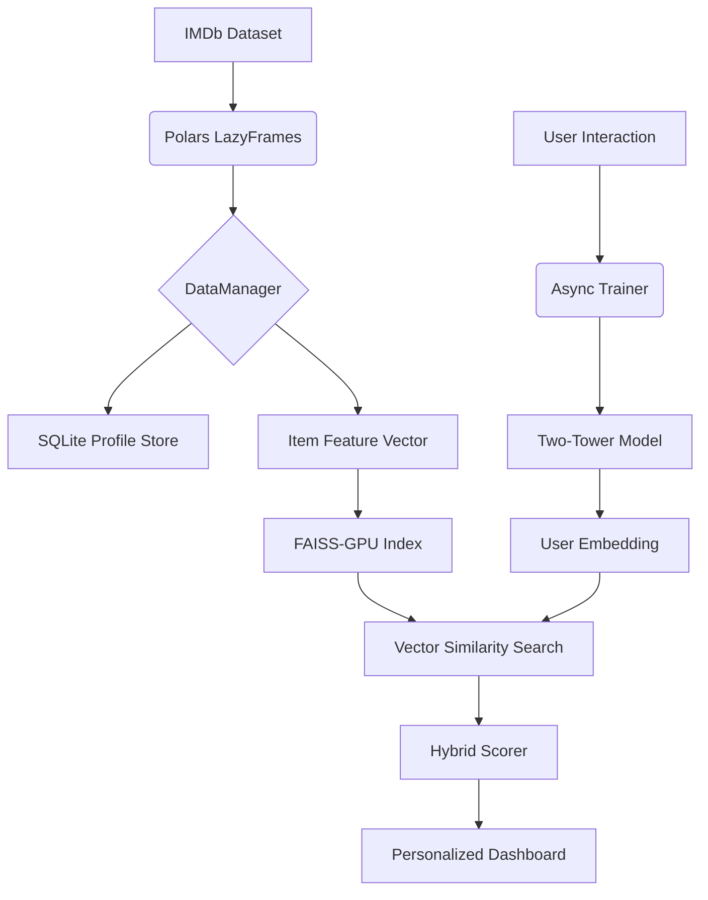

# 🎬 AI Hybrid Movie & TV Recommendation Engine

A high-performance, GPU-accelerated recommendation system built with **PyTorch**, **Polars**, and **FAISS**. This engine uses a **Two-Tower Neural Network** architecture to provide real-time, personalized movie and TV show suggestions based on granular user behavior.


## 🚀 Key Features

### 🧠 Advanced Recommendation Model
- **Two-Tower Architecture**: Separate neural networks for User and Item embeddings, optimized for high-dimensional feature matching.
- **Hybrid Filtering**: Combines collaborative signals (user preferences) with content-based features (genres, ratings, years).
- **FAISS-GPU Integration**: Sub-millisecond similarity search using GPU-accelerated vector indices with **Float16 (FP16)** storage for reduced VRAM footprint.

### 📊 Granular User Tracking
- **Decoupled Parameters**: Independent tracking of **Watched (Seen)** status and **Preferences (Like/Dislike)**.
- **TV Show Hierarchy**: Feedback can be provided at the **Series, Season, or Episode** level.
- **Exclusion Sync**: Automatically filters out "Seen" content from recommendations while using "Liked" content to refine the user embedding.

### ⚡ Performance & Efficiency
- **Polars LazyFrames**: Memory-efficient processing of IMDb’s 10M+ row dataset using `scan_csv` and lazy evaluation.
- **Async Background Training**: Real-time model updates triggered by user interactions (Like/Dislike) without freezing the UI.
- **GPU Optimization**: Hardwired for NVIDIA hardware (e.g., RTX 3050) with `cudnn.benchmark` enabled.

## 🛠️ Technology Stack

- **Framework**: Streamlit (UI/Dashboard)
- **ML Core**: PyTorch (Neural Networks)
- **Data Engine**: Polars (Data Manipulation)
- **Vector Search**: FAISS (GPU Accelerated)
- **Database**: SQLite (User Profiles & Feedback)
- **Dataset**: Official IMDb Datasets (Basics, Ratings, Episodes)

## 📁 Project Structure

```text
Engine/
├── data/               # IMDb Datasets (TSV.GZ) & SQLite DB
├── src/
│   ├── app.py          # Main Streamlit Dashboard & UI
│   ├── data_manager.py # IMDb Data Ingestion & SQL Profile Management
│   ├── model.py        # Two-Tower PyTorch Architecture
│   ├── recommender.py  # FAISS Indexing & Hybrid Scoring
│   ├── trainer.py      # Async Background Training Logic
├── requirements.txt    # Dependency List
└── README.md           # This file
```

## ⚙️ Installation & Setup

1. **Clone the repository**:
   ```bash
   git clone <repo-url>
   cd Engine
   ```

2. **Install Dependencies**:
   ```bash
   pip install -r requirements.txt
   ```

3. **Hardware Check**:
   Ensure you have an NVIDIA GPU and CUDA drivers installed for maximum performance. The system will fallback to CPU if no GPU is detected.

4. **Launch the Engine**:
   ```bash
   python3 -m streamlit run src/app.py
   ```

## 📈 System Architecture



## 📝 License
Distributed under the MIT License. See `LICENSE` for more information.

---
*Built for cinematic excellence.* 🍿
